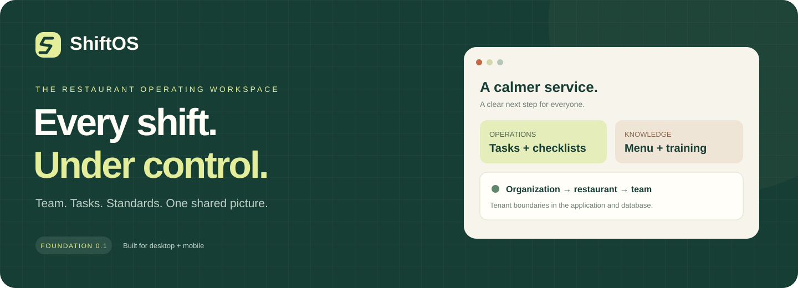

<p align="center"></p>

<p align="center">
  <a href="https://github.com/arturuseinov49-collab/ShiftOS/actions/workflows/ci.yml"></a>
  
  
  
  
</p>

# ShiftOS

Цифровой управляющий заведением. Версия 0.2.0 — рабочие сценарии смены в интерактивном демо.

**[Открыть демо →](https://shiftos.191-44-44-231.sslip.io/demo)** · HTTPS · вымышленные данные · вход не требуется

Кухня не успевает отдать заказ, бар не подтвердил готовность, поставщик привёз меньше,
а владелец не понимает результат смены. ShiftOS связывает факты, ответственных и действия:
задержка → разбор на участке → выполнение → проверка результата.

**[Архитектура](docs/architecture.md) · [Развёртывание](docs/deployment.md) · [План развития](docs/roadmap.md) · [Разработка](CONTRIBUTING.md) · [Безопасность](SECURITY.md)**

| Доступно сейчас                                        | Следующий этап                                          |
| ------------------------------------------------------ | ------------------------------------------------------- |
| Кухня / бар / зал, задачи с проверкой, очередь заказов | Реальные смены и совместная работа в Supabase           |
| Приёмка, расхождения, P&L, настройка обоих POS в демо  | Серверные адаптеры iiko / r_keeper под конкретный пилот |
| Основа Auth, multi-tenant RLS и операций с задачами    | Приглашения, права на заведения, аудит                  |
| Независимый AI gateway, отключённый в production       | AI на проверенных фактах, с квотами и аудитом           |

Это ранняя версия продукта. Демо использует вымышленные данные; готовность интерфейса
не означает, что все модули уже подключены к рабочей базе.

## Быстрый запуск

Требуется Node.js 22.14+ и npm. Версии зависимостей закреплены в `package-lock.json`.

```powershell
git clone https://github.com/arturuseinov49-collab/ShiftOS.git
cd ShiftOS
npm ci
npm run dev
```

Откройте http://127.0.0.1:3000/demo. Ключи не нужны. Демо отделено от базы, содержит вымышленные
заведения и людей. Все изменения сохраняются только в localStorage этого браузера.
Сброс: Настройки → Сбросить демо-данные. Числа на обзоре рассчитываются из текущих данных.

## Что реализовано

- Next.js 16 App Router, TypeScript strict, Tailwind 4, локальные компоненты shadcn/ui (Radix).
- Адаптивный dashboard, мобильная навигация, разделы задач, чек-листов, команды, меню,
  обучения, финансов, поставок и настроек. Сотрудник видит свои задания и участок,
  администратор управляет сменой, владелец видит финансовый результат и настройки интеграций.
- Кухня / бар / зал: ответственный, время работы, норматив приготовления, чек-листы готовности.
  Задачи из стандартов и отклонений, ручное назначение и распределение по нагрузке,
  результат сотрудника и отдельная проверка администратором.
- Общая очередь: кухня готовит блюда, бар — напитки, зал закрывает готовый заказ.
  Превышение норматива создаёт конкретную подсказку с источником и ответственным.
- Приёмка фактического количества, комментарий при недостаче, блокировка оплаты,
  исправленный документ с пересчётом и отметка оплаты владельцем. Это демо, переводов нет.
- P&L за день / 7 / 30 дней, одна точка или сеть, скидки, возвраты, себестоимость,
  расходы, прибыль / убыток, средний чек и CSV. Покупка продуктов не вычитается повторно
  поверх себестоимости продаж.
- Независимый POS-контракт и демо-адаптеры iiko / r_keeper, выбор потоков заказов и
  накладных, журнал импорта и защита от повторов. Реальных API-запросов и полей для ключей нет.
- Supabase SSR: отдельные browser/server clients, обновление cookie в `proxy.ts`, проверка
  пользователя на сервере, вход/регистрация по почте и паролю, PKCE callback, выход.
- `/workspace`: список доступных организаций и атомарное создание организации, заведения,
  ролей и owner membership. `/workspace/[organizationId]/[section]`: реальные данные через RLS.
- Server Actions создания задачи и изменения её статуса с Zod и проверкой `tasks.write`.
- 20 публичных таблиц, private answer keys, миграции RLS, RBAC и Storage. Типы получены
  из проверенных миграций, воспроизводятся через `npm run db:types`.
- Независимый AI gateway, интерфейс провайдера, тестовый адаптер, timeout/abort.
  API `/api/ai/briefing` получает факты только после проверки пользователя, организации и `ai.use`.
- Контракты событий и место под vision. Камеры, видео и распознавание не реализованы.

## Подключить Supabase

1. Создайте **отдельный пустой проект Supabase**. Существующую базу другого продукта не используйте.
2. Примените по порядку оба файла из `supabase/migrations` через SQL Editor Supabase.
   Альтернатива: Supabase CLI `supabase link --project-ref <ref>` и `supabase db push`.
3. Скопируйте `.env.example` в `.env.local`, заполните `NEXT_PUBLIC_SUPABASE_URL` и
   `NEXT_PUBLIC_SUPABASE_PUBLISHABLE_KEY` из Connect. Для обычного приложения service role не нужен.
4. В Auth → URL Configuration укажите Site URL `http://127.0.0.1:3000` и Redirect URL
   `http://127.0.0.1:3000/auth/callback`. При использовании localhost добавьте его отдельно.
   Включите email/password и подтверждение почты, минимальный пароль 12 символов.
5. Перезапустите приложение, откройте `/login`, зарегистрируйтесь и подтвердите почту в том же
   браузере (PKCE). Затем войдите, создайте организацию и первую задачу.

Для локального Supabase нужны Docker и Supabase CLI: `supabase start`, затем `supabase db reset`.
**db reset удаляет данные локальной базы**, используйте только для одноразового dev-окружения.
`supabase/config.toml` уже включён. В этой среде Docker/Supabase не запускались;
Auth, SMTP, Storage HTTP API и реальный PostgREST требуют отдельной интеграционной проверки.

Для сервера подготовлены standalone-сборка, systemd и Caddy с HTTPS.
Отдельная рабочая база Supabase подключается по инструкции выше; её создание не входит
в установку веб-приложения. Порядок запуска и отката описан в [руководстве](docs/deployment.md).

## Структура

```text
src/
  app/
    demo/[[...section]]/        публичное, изолированное демо
    login/                     вход и регистрация
    auth/callback/             обмен PKCE-кода на сессию
    workspace/                 выбор/создание организации
      [organizationId]/...     защищённое рабочее пространство
    api/ai/briefing/            серверная граница AI
    api/health/                проверка доступности приложения
  components/
    ui/                        shadcn/ui
    demo/                      интерактивные операции, локальный demo provider
    workspace/                 адаптивная оболочка и экраны
  lib/
    supabase/                  typed clients + database.types.ts
    env.ts                     доступность конфигурации
  modules/
    identity/                  пользователь, tenant, onboarding
    tasks/                     безопасные действия с задачами
    operations/                роли демо, участки, заказы, поставки, правила отклонений
    finance/                   результат по нормализованным данным
    integrations/              POS-контракт и изолированные демо-адаптеры
    workspace/                 модели представления, демо, repository
    ai/                        gateway, contracts, providers
    events/                    контракт будущей доставки событий
    vision/                    граница будущего модуля
  proxy.ts
supabase/
  migrations/                  схема, политики, приватный bucket
  config.toml
scripts/                       PostgreSQL test harness и генерация типов
tests/                         изоляция организаций и AI gateway
e2e/                           проверки desktop/mobile
docs/                          архитектура, границы и следующий спринт
deploy/                        установка, релизы, systemd и Caddy
.env.example
.github/workflows/ci.yml
```

## Проверки

```powershell
npm run lint
npm run typecheck
npm test
npm run build
npm run db:types
npx playwright install chromium
npm run test:e2e
```

`npm test` выполняет миграции в настоящем PostgreSQL движке PGlite/WASM. В тестах `auth.uid()`
и служебные схемы Supabase моделируются: это проверка SQL/политик, не интеграционный тест всего Supabase.
Playwright запускает production build на порту 3100; предварительно выполните `npm run build`.

## Границы текущей версии

- UI команды/меню/обучения в live-режиме пока только читает данные. Приглашений и редакторов нет.
- Live-чек-листы показывают шаблоны; выполнение смен/история не подключены. В демо отметки работают.
- Новые операции, финансовые данные и POS-импорт работают на вымышленном снимке в `/demo`.
  Смена зафиксирована на 29 сентября 2026, 16:00. Демо не синхронизируется между людьми.
- Демо-переключатель роли — средство просмотра сценариев. Это не авторизация и не защита
  данных: весь вымышленный снимок доступен в браузере. Реальные права проверяются сервером/RLS.
- Live-POS, учёт присутствия, внешняя AI-модель, grading тестов, уведомления и vision не подключены.
- Роль `staff` по умолчанию имеет только чтение базовых модулей. Менеджер пишет рабочие данные.
  Прямое изменение memberships/roles/role_permissions через клиент закрыто для всех.
- Права пока уровня организации; выбор заведения — фильтр, **не дополнительная граница доступа**.
- Списки задач, сотрудников и меню ограничены первыми 200 записями. Это стартовая выборка,
  не аналитическое хранилище. Пагинация и полные агрегаты нужны до роста пилота.
- `users` — глобальный профиль собственной учётной записи; `permissions` — глобальный справочник.
  Все рабочие сущности и связи принадлежат `organization_id`.
- AI_PROVIDER=disabled по умолчанию. `mock` работает только в development/test, без внешней модели.
  В production провайдер закрыт до добавления квот, журнала запросов и проверки интеграции.

## Следующий конкретный шаг

Подключить отдельный Supabase dev-проект и пройти сквозной сценарий:
два аккаунта → две организации → заведения → задачи → проверка отсутствия доступа к чужой организации.
Затем перенести один полный сценарий смены из демо в защищённую базу: администратор
назначает задачу сотруднику → сотрудник передаёт результат → администратор принимает.
Добавить приглашения, права на заведение и историю чек-листов. POS подключать по версии
и доступным API конкретного пилота. [Сценарии и границы 0.2](docs/operations-demo.md).

Источники решений: [Next.js App Router](https://nextjs.org/docs/app/getting-started),
[Supabase SSR](https://supabase.com/docs/guides/auth/server-side/creating-a-client),
[Supabase RLS](https://supabase.com/docs/guides/database/postgres/row-level-security),
[Storage access control](https://supabase.com/docs/guides/storage/security/access-control),
[shadcn/ui](https://ui.shadcn.com/docs/installation/manual).

## Лицензия

Открытая лицензия пока не выбрана. Публичная доступность репозитория не означает
предоставления разрешения на использование, распространение или коммерческое применение кода.
