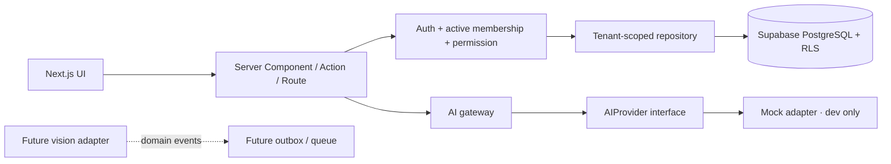
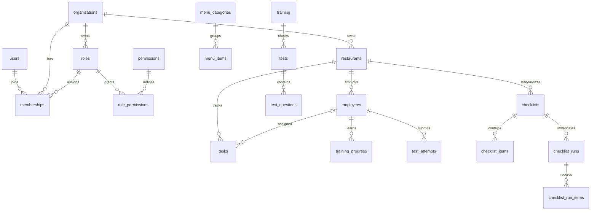

# Архитектура и границы первого спринта

## Поток запроса

Демо никогда не передаёт свои данные в AI API или live repository. `/workspace` не возвращает
демо при ошибках конфигурации/входа. Tenant ID из маршрута или тела запроса всегда недоверенный:
`requireTenant()` проверяет membership, SQL независимо проверяет права через auth.uid().

## Модель

Каждый FK между рабочими сущностями включает organization_id. Дополнительные составные ключи
не позволяют прикрепить ответ выполнения чек-листа к пункту другого шаблона. Trigger запрещает
перенос tenant-owned строки между организациями, даже если пользователь состоит в обеих.
Членство сотрудника (`employees.user_id`) необязательно; при наличии оно должно существовать в том же tenant.

## Доступ

| Объект                            | Чтение                      | Изменение                       |
| --------------------------------- | --------------------------- | ------------------------------- |
| organizations                     | активные участники          | owner: имя; создание только RPC |
| users                             | только собственный профиль  | только display_name             |
| memberships                       | собственные или access.read | клиенту запрещено               |
| roles / role_permissions          | активные участники          | клиенту запрещено               |
| permissions                       | authenticated               | клиенту запрещено               |
| рабочие таблицы                   | module.read                 | module.write                    |
| training_progress / test_attempts | training.write              | клиенту запрещено               |
| private.test_answer_keys          | клиенту запрещено           | клиенту запрещено               |
| organization-files                | storage.read + org prefix   | storage.write + org prefix      |

Owner получает все стартовые права. Manager получает все, кроме organizations.manage.
Staff получает restaurants/menu/training/tasks/checklists.read. Нельзя полагаться на редактируемый
user_metadata для роли. Он применяется только к display_name. Политики не зависят от UI-фильтра ресторана.

`SECURITY DEFINER` используется только для проверки текущего пользователя, создания профиля
и транзакционного onboarding. У функций фиксированный search_path, публичный EXECUTE отозван.
Настройка RLS включает отзыв широких table grants, в том числе TRUNCATE, перед выдачей нужных прав.

Storage bucket приватный, лимит файла 10 MiB, разрешены JPEG/PNG/WebP/PDF. Пути:
`<organization_uuid>/<file_uuid>.<ext>`. Подписанные URL ещё не выдаются UI.
Нельзя включать private в exposed schemas. Миграции рассчитаны на свежий проект;
политики Storage с других приложений в общей базе могут расширить доступ.

## AI и события

AIProvider — собственный контракт, без импортов OpenAI/SDK в бизнес-модулях. Gateway ограничивает время
вызова и передаёт AbortSignal. Сервер получает числовые факты из базы, а не доверяет фактам клиента.
Модели не имеют инструментов изменения данных. Лимит тела запроса — 2 KiB, same-origin проверка,
проверка активного членства и ai.use. Живой провайдер пока отсутствует; до его подключения нужны
распределённые квоты на организацию, audit trail, ограничение вывода, контроль расходов и регрессии качества.

Контракт DomainEvent содержит organizationId, restaurantId, id, correlationId, occurredAt,
schemaVersion и source. Шины событий в памяти нет: следующий этап должен использовать transactional
outbox, идемпотентные обработчики и очередь. Vision пока только архитектурная граница.

## Проверки перед пилотом

Локальные тесты проверяют реальный SQL/RLS в PGlite. Они не проверяют SMTP/refresh/callback целиком,
поведение PostgREST, конфигурацию production Supabase или HTTP Storage. После подключения отдельной
dev-базы эти проверки обязательны. Health route проверяет приложение, не доступность базы.
