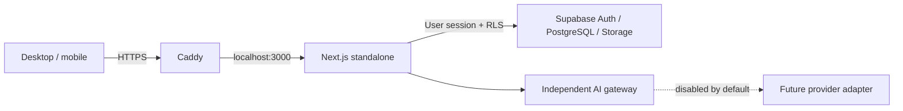

# Запуск на сервере

Для первого пилота: отдельный Debian 13 x64 сервер, 1 ГБ RAM, 20 ГБ диска,
внешний Supabase. Сборка использует 2 ГБ swap; под нагрузку тариф нужно пересмотреть.
Веб-приложение работает от `shiftos`, слушает только `127.0.0.1:3000`.
Caddy принимает внешний трафик и обслуживает HTTPS, systemd перезапускает упавший процесс.



## Первый запуск

Скрипт `bootstrap.sh` предназначен **только для нового выделенного сервера**: он устанавливает
Node.js 22 и Caddy, настраивает firewall (SSH/HTTP/HTTPS), пользователя и swap.
Прочитайте его перед запуском. Домены и серверные ключи в репозитории не хранятся.

1. Направьте DNS A-запись своего домена на сервер. Для временного демо допустим DNS-сервис
   sslip.io; для реальной работы используйте собственный домен.
2. Загрузите `deploy/bootstrap.sh` на сервер и от root выполните:

```bash
bash /root/bootstrap.sh app.example.com
install -d -o shiftos -g shiftos /opt/shiftos/source
runuser -u shiftos -- git clone https://github.com/arturuseinov49-collab/ShiftOS.git /opt/shiftos/source
bash /opt/shiftos/source/deploy/release.sh /opt/shiftos/source
```

3. Проверьте `https://app.example.com/api/health` и `/demo`.
4. Проверьте `systemctl status shiftos caddy` и `ufw status`.

Файл `/etc/shiftos/app.env` принадлежит root, доступен на чтение группе shiftos (640).
В нём допустимы только следующие настройки:

```dotenv
APP_ORIGIN=https://app.example.com
NEXT_PUBLIC_SUPABASE_URL=
NEXT_PUBLIC_SUPABASE_PUBLISHABLE_KEY=
AI_PROVIDER=disabled
```

С пустой парой Supabase работает только изолированное демо. Production-AI отключён.
`NEXT_PUBLIC_*` попадают в клиентскую сборку: для них используйте только публичный URL
и publishable key. **Не вставляйте service_role, secret key, пароль базы или ключ AI.**

## Подключение реальной базы

Примените миграции в отдельном Supabase-проекте, задайте публичные настройки в `app.env`,
Site URL и точный `/auth/callback` в Supabase Auth. После изменения `NEXT_PUBLIC_*` нужна
новая сборка через `release.sh`; одного перезапуска недостаточно. APP_ORIGIN задаёт доверенный
адрес для проверки Origin и переходов после входа за reverse proxy.

До приглашения сотрудников проверьте вход, выход, Storage и изоляцию двух организаций
на реальном Supabase. `/api/health` проверяет только процесс приложения, **не доступность базы**.

## Обновление и откат

Обновляйте только проверенный коммит. Автоматический deploy по каждому push пока не включён.

```bash
runuser -u shiftos -- git -C /opt/shiftos/source fetch origin
runuser -u shiftos -- git -C /opt/shiftos/source checkout --detach <reviewed-commit>
bash /opt/shiftos/source/deploy/release.sh /opt/shiftos/source
```

Скрипт собирает новую версию до переключения `current`. Если стартовая проверка доступности
не проходит, возвращает прежний релиз. Старые релизы сохраняются; контролируйте свободное место.
Миграции базы этот скрипт не выполняет и не откатывает.

Для ручного отката проверьте путь в `/opt/shiftos/previous-release`, затем:

```bash
previous=$(cat /opt/shiftos/previous-release)
case "$previous" in /opt/shiftos/releases/*) ;; *) exit 1;; esac
test -f "$previous/server.js" || exit 1
ln -s "$previous" /opt/shiftos/current.rollback
mv -Tf /opt/shiftos/current.rollback /opt/shiftos/current
systemctl restart shiftos
curl --fail http://127.0.0.1:3000/api/health
```

Логи: `journalctl -u shiftos -n 100` и `journalctl -u caddy -n 100`.
Не публикуйте логи с токенами, callback-кодами или данными пользователей.
Автоперезапуск — не внешний мониторинг: отдельные проверки доступности и оповещения ещё предстоит подключить.

Источники: [Next.js self-hosting](https://nextjs.org/docs/app/guides/self-hosting),
[Caddy installation](https://caddyserver.com/docs/install),
[Caddy HTTPS](https://caddyserver.com/docs/automatic-https), [sslip.io](https://sslip.io/).
